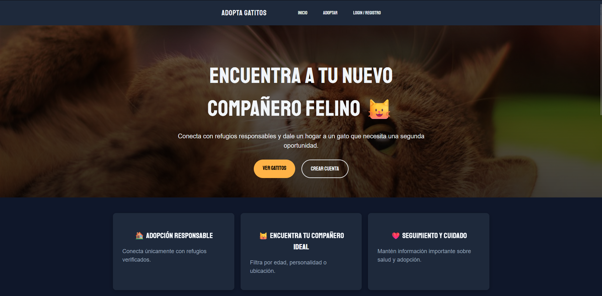
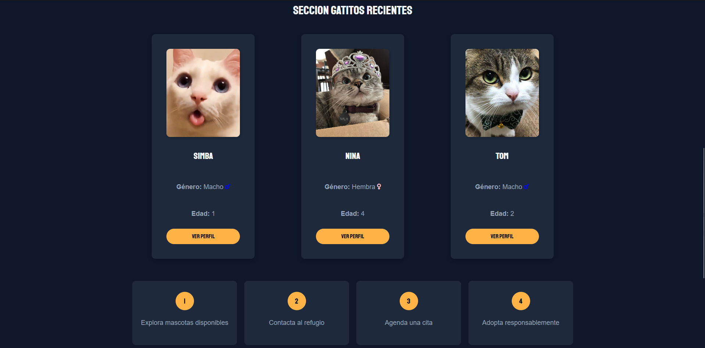
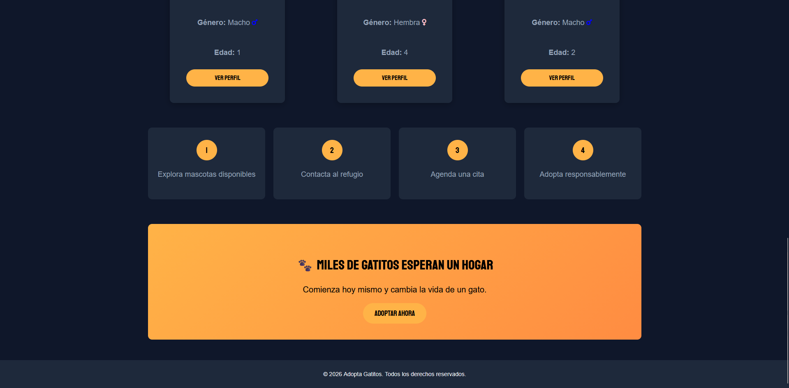
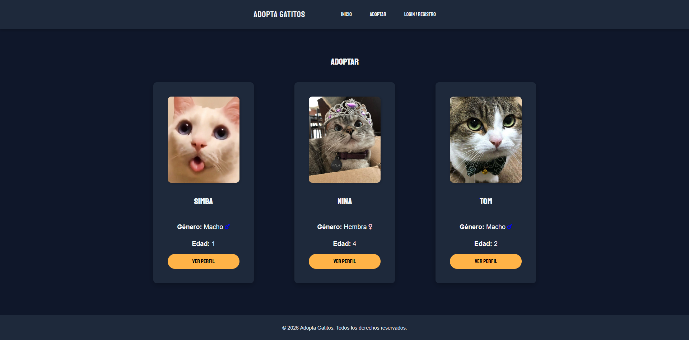
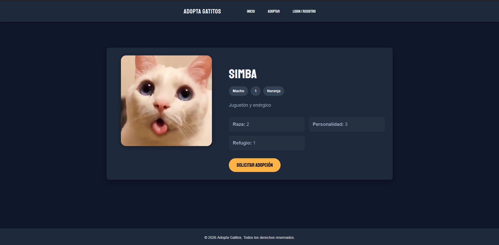
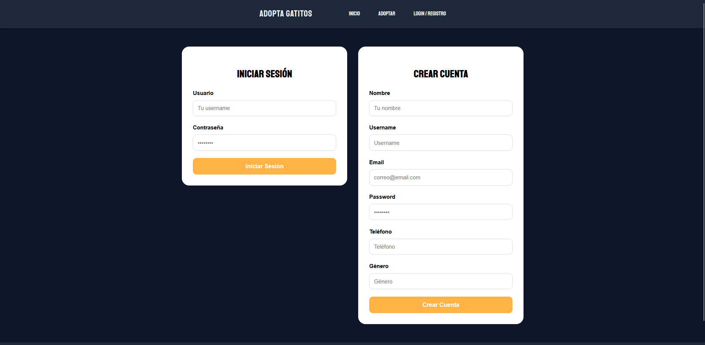

# 🐱 Adopta Gatitos

> Plataforma web full stack para facilitar la adopción responsable de gatitos mediante conexión entre ciudadanos y refugios afiliados.


---

## 🌐 Descripción

**Adopta Gatitos** es una plataforma web full stack desarrollada para facilitar la adopción responsable de gatitos mediante un sistema que conecta ciudadanos con refugios afiliados.

El proyecto busca centralizar el proceso de adopción, permitiendo consultar gatitos disponibles, gestionar solicitudes de visita y dar seguimiento al bienestar del animal posterior a la adopción.

Fue desarrollado como un proyecto experimental para explorar arquitectura cliente-servidor, sistemas multiusuario, persistencia de datos, lógica de negocio y administración de contenido desde backend propio.

Actualmente el desarrollo se encuentra enfocado en el sistema de autenticación y gestión de usuarios adoptantes, mientras que algunos procesos del flujo de adopción continúan en implementación.

---

## 📸 Capturas

<table>

<tr>
<td align="center">
<b>Hero</b><br>

</td>
<td align="center">
<b>Gatitos Recientes</b><br>

</td>
</tr>
<tr>

<td align="center">
<b>CTA</b><br>

</td>

<td align="center">
<b>Listado Gatitos</b><br>

</td>
</tr>
<tr>
<td align="center">
<b>Perfil Gatito</b><br>

</td>

<td align="center">
<b>Inicio Sesion / Registro</b><br>

</td>
</tr>
</table>

> Puedes ver más capturas dentro de la carpeta `/screenshots`.

---

## ✨ Características principales

### Técnicas

- 🌐 Arquitectura cliente-servidor
- 🔐 Sistema de autenticación e inicio de sesión
- 🔐 Persistencia de sesión mediante **PHP Sessions**
- 🧩 Separación entre frontend y backend
- 🗄️ Persistencia de datos mediante MySQL
- ⚙️ Backend modular en PHP
- 🧪 Manejo de transacciones SQL para integridad de datos
- ⚡ Diseño responsive para múltiples dispositivos

### Funcionales

👤 Usuarios / Adoptantes

- 🐱 Explorar gatitos disponibles para adopción
- 📅 Solicitar visitas a refugios afiliados
- 📝 Registro de cartilla digital del gato adoptado
- 📸 Subir evidencia del bienestar posterior a la adopción (cada cierto tiempo)

🏠 Refugios afiliados

- 🐾 Registro de gatos disponibles
- 📅 Gestión de solicitudes de visita
- 📝 Administración de cartillas de salud
- 📦 Gestión centralizada de contenido

---

## 🛠️ Tecnologías utilizadas

### Frontend web

- HTML
- CSS
- JavaScript

### Backend

- PHP
- MySQL

<!-- ### Infraestructura

- Hostinger
- Hosting y Base de Datos en dominio propio -->

### Herramientas

- VS Code
- Postman

---

## 📊 Estadísticas del proyecto

| Métrica          | Valor                       |
| ---------------- | --------------------------- |
| Arquitectura     | Cliente-Servidor / API REST |
| Tipo de proyecto | Plataforma web full stack   |
| Estado           | En desarrollo               |
| Roles soportados | Adoptantes / Refugios       |

## 📊 Estado actual del proyecto

### Implementado

- ✅ Registro e inicio de sesión de usuarios adoptantes
- ✅ Persistencia de datos mediante backend y base de datos
- ✅ Sistema base de autenticación

### En desarrollo

- 🚧 Flujo completo de adopción desde frontend
- 🚧 Paneles para refugios afiliados
- 🚧 Integración completa frontend-backend

---

## 🧠 Arquitectura del proyecto

Adopta Gatitos utiliza una arquitectura **cliente-servidor**, separando frontend web, API backend y base de datos.

```text
    Adoptante / Refugio
            ↓
    Frontend Web (HTML/CSS/JS)
            ↓
        API REST (PHP)
            ↓
        MySQL Database
```

La aplicación implementa una estructura modular separando responsabilidades entre:

- Frontend web (HTML + CSS + JavaScript) para interfaz, navegación y experiencia de usuario.
- API REST en PHP para autenticación, gestión de usuarios, refugios y adopciones.
- Base de datos MySQL para persistencia de información.

El backend está organizado mediante una estructura modular basada en endpoints y clases PHP, separando funcionalidades por dominio (usuarios, encargados de refugios, gatitos), facilitando mantenimiento y escalabilidad del proyecto.

Además, el proyecto implementa:

- 🔐 Persistencia de sesión mediante PHP Sessions
- 🔐 Transacciones SQL
- ⚙️ Separación frontend/backend

---

## ⚙️ Configuración del proyecto

Por motivos de seguridad, las credenciales del backend y conexión a base de datos **no se encuentran incluidas dentro del repositorio**.

El proyecto utiliza:

- ⚙️ Backend propio en **PHP**
- 🗄️ **MySQL** alojado remotamente
- 🔐 Variables privadas para conexión
- 🌐 Endpoints personalizados para autenticación y contenido

Las capturas y estructura del proyecto muestran el funcionamiento general de la aplicación.

---

## 🌐 Demo / Despliegue

Actualmente el proyecto no se encuentra desplegado públicamente.

Se planea implementar mediante un subdominio para pruebas y despliegue progresivo.

---

<!-- ## 🎥 Devlogs

El desarrollo ha sido documentado públicamente como parte de mi proceso de aprendizaje y construcción de producto.

- 🎬 **Devlog #1** _[Enlace directo a YouTube](https://www.youtube.com/watch?v=c-ppy8c04Ic)_
- 🎬 **Devlog #2** _[Enlace directo a YouTube](https://www.youtube.com/watch?v=02eeZJ_gKsw)_
- 🎬 **Devlog #3** _[Enlace directo a YouTube](https://www.youtube.com/watch?v=tgFm2hRZP60)_

--- -->

## 🔮 Futuras mejoras

- 🛡️ Mejoras de seguridad
- 📊 Dashboard para refugios
- 🔗 Integración completa del sistema de adopción
- 📝 Implementación del sistema de cartilla de salud digital
- 📸 Almacenamiento de evidencia del bienestar de los gatitos
- ⚡ Optimización de consultas y endpoints

---

## 👨‍💻 Autor

**Martín Bibiano (MudisDev)**

📧 Email: [devgames.studio4@gmail.com](mailto:devgames.studio4@gmail.com)
💼 Portfolio: _[mudisdev.com](https://mudisdev.com)_
🐙 GitHub: _[github.com/MudisDev](https://github.com/MudisDev)_

---

## ⚠️ Estado del Proyecto

Este proyecto se encuentra en desarrollo activo y continúa recibiendo mejoras de rendimiento, arquitectura y nuevas funcionalidades.